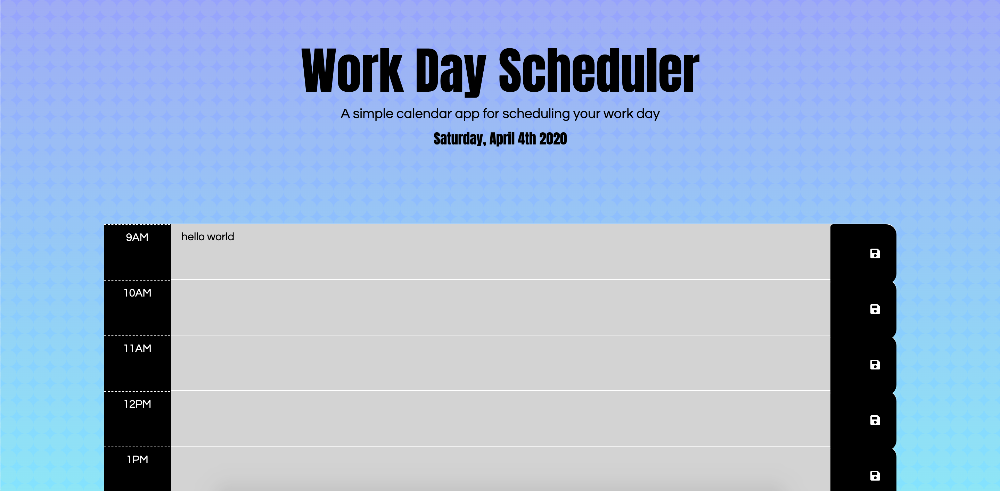

# Work Day Scheduler
Created during Week 5 of UPenn Coding Bootcamp.

## Overview
In this assignment, the challenge was to create a simple calendar application that allows the user to save events for each hour of the day. This app runs in the browser and features dynamically updated HTML and CSS powered by jQuery.

## Utilizing the App
- View the app: [Here](https://acucunato.github.io/work-day-scheduler/ "Here")
- User can input a task in the input field for each hour during the work day 9am-5pm.
- User can save each task by clicking the save button next to the input field.
- Each timeblock will be color coded to indicate whether it is past, present or future hour. 

## Demo

## Tech used
- HTML
- CSS
- Bootstrap
- Javascript
- jQuery
- Moment.js API

## Contributers
- Alyssa Cucunato